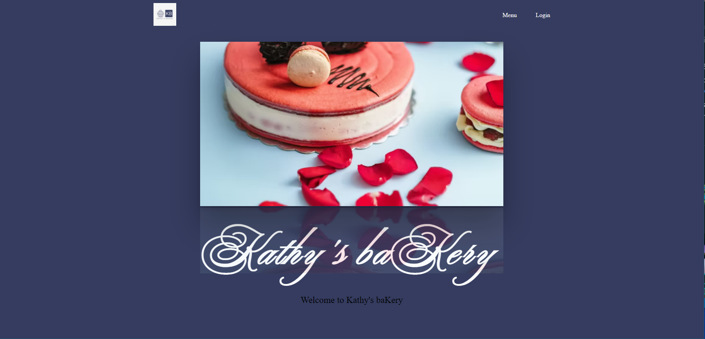
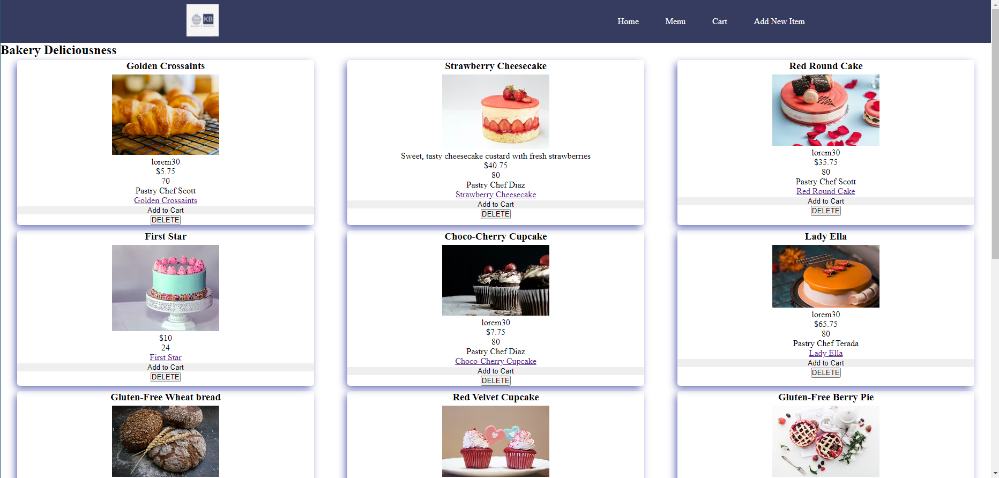
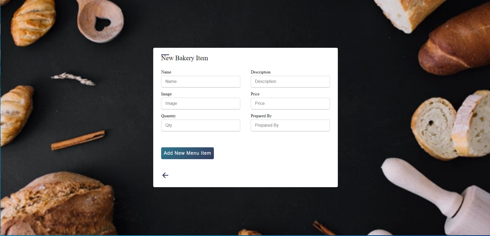
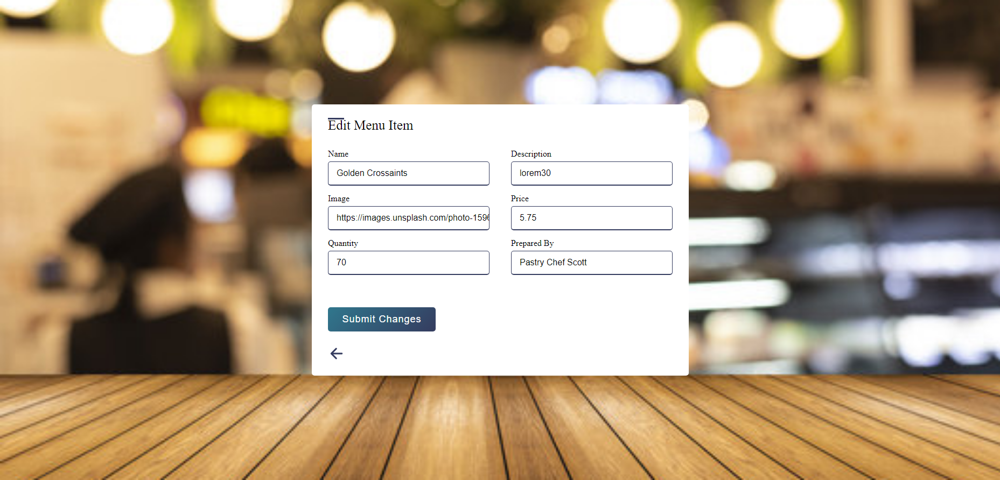

# Kathys-baKery

#### An Bakery Application that will allow users to shop for baked goods and also allow management to maintain inventory by updating, removing or adding a new item to the bakery.

## Technology Used

- ### HTML

- ### Cascading Style Sheet(CSS)

- ### Javascript

- ### Google Fonts

- ### Express

- ### NodeJS

- ### MONGODB

### Mongoose

## Screenshots

### Homepage

## 

### Menu Index Page

## 

### New Item Page

### Edit Show Page

## 

### Edit Item Page

## 

[Click here](https://kathys-bakery.herokuapp.com/user) to see deployed project

Run `npm install` to install necessary dependencies.

Future enhancements

- CMS for staff to maintain Inventory list, Budget, Payroll, Vendors, Employees

- Implement a shopping cart feature for the user

- User accounts feature to maintain their information and show order history.
